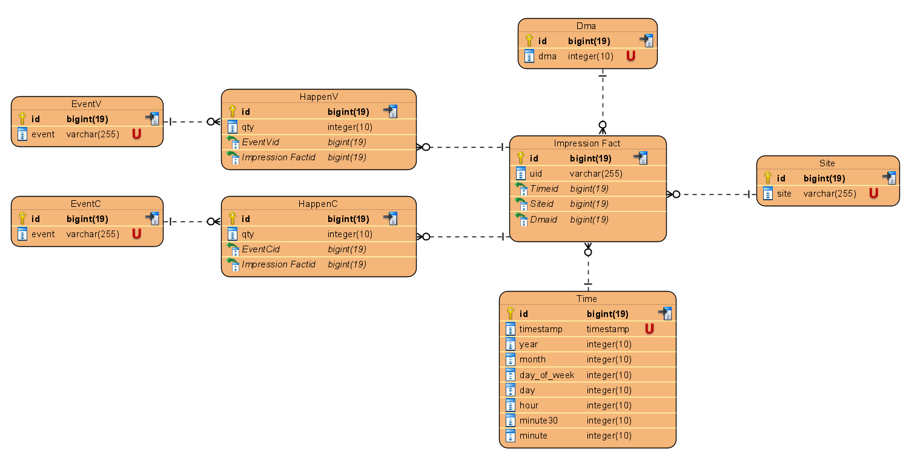

# Adexcel - CTR

## Online version
http://176.118.165.246:8080/

## Quick start on local mashine
1 Prerequisites:
- Java 11 and environment variable JAVA_HOME pointing at JDK
- Maven
- Docker, Docker Compose

2 Run commands from folder with cloned porject:
```
mvn -DskipTests=true clean package
docker build -t adexcel_ctr .
docker-compose up --detach
```
3 Open in browser
http://localhost:8080/

4 To stop or delete:
```
docker-compose stop
docker-compose down -v
```

## Manual start with external database
1 set JAVA_HOME environment variable
```
set JAVA_HOME=YOUR_PATH_TO_JDK_11_FOLDER
``` 
2 Create empty 'ctr' database
3 Set connection credentials to external 'ctr' database in [application.properties](src/main/resources/application.properties):
```
spring.datasource.url
spring.datasource.username
spring.datasource.password
```

3 Run commands from folder with cloned porject:
```
mvn -DskipTests=true clean package
java -jar target/ctr-0.0.1-SNAPSHOT.jar
```

4 Open in browser
http://localhost:8080/

## Project description
- Backend is implemented on Spring Boot using JAVA 11
- Database level leverages PostgreSQL. You can use any other SQL DB changing suitable connection properties at [application.properties](src/main/resources/application.properties) but I didn't check the functionality of this application with other DBMSs. However, I think it should work as I don't use any Postgres-specific SQL commands in DB requests.
- Interaction between application and database is based on Hibernate library and CRUD Repository interface
- Frontend interacts with backend through REST API.
- Frontend leverages Thymeleaf template and runs as Single page application (SPA).
- For SPA functionality I used AngularJS framework
- UI based on AngularJS Materials library (common elements and tables) and Chart.js (Graphs rendering).

## Task implementation details

1 Since this is only test task I let myself make some assumptions and simplification. Otherwise, I would not be able to meet the deadline. Regarding this I left some 'TODO' comment in code. These TODOs mean: I know that app will be better if I do this, but it is only test taks :)
Due to the same reason my task implementation doesn't take into accont the following aspects:
- App uploads data only once during first start if 'sees' empty ctr database. Source csv files are present staticaly in [resources](src/main/resources) folder. I didn`t implement any online data upload via UI
- Some SQL queries are time costly and in real environment problem of caching must be considered
- To speed up development process I used Spring Boot with auto configuration functionality. Hence, I don't use sessionFactory for DB queries explicitly but utilize CRUD Repository interface with annotation-based SQL queries. So some queries turned out to be too verbose.
- I made graphs for several time resolutions: days, hours and 30 minutes. But I noticed that only day graphs look sensible: hour and 30 minutes graphs have rare and very high jumps and don't look readable. Actually I don't know for what time periods have you used to consider CTR and EvPM values.
- Mikhail said that impression uids are not necessary unique. I analyzed such cases and noticed that majority of them had happened during 1 - 2 minutes interval and have similar parameters (dma, OS etc.). I have not information about the 'nature' of this phenomenon, but I decided to link the only one of all non-unique uids to corresponding event. If maximum interval between events is more than 100 second I ignore it as unresolved. As result, the given dataset has only 5 such unresolved cases. In the end uploading process application will output report where you will find information about uids resolving. It will look like this:

```
2023-02-18 11:11:02.131  INFO 1 --- [           main] adxcel.ctr.DbInitializer                 : Events import report: tableType=EVENT, sourceRowsProcessed=15359 rowsImported=15236, uidCollisionsQty=151, unresolvedUidCollisionsQty=5
, unmappedUidQty=118, unresolvedList=[00000000-0000-0001-6282-070541541624, 00000000-0000-0001-6282-070541541624, 00000000-0000-0001-6282-551868761078, 00000000-0000-0001-6282-551868761078, 00000000-0000-0001-6281-330433531561]
```
Resolving logic is implemented at [EventDbImporter](src/main/java/adxcel/ctr/service/dataimport/EventDbImporter.java)
- I don't consider such fields in Impressions table: fc_imp_chk, fc_time_chk, utmtr, osName, model, hardware since they don't participate in calculations

2 Database structure uses Data cube with dimension tables: Dma, Site, EventV (view), EventC (click), Time.
Measure table is presented by combination of Impression Fact, HappenV, HappenC tables.

HappenV and HappenC entities needed for many-to-many relationship elimination. These tables store information about quantity of happened events for every impression
Time entity is used instead of timestamp field for facilitation of calculations for different time resolutions (by days, hours etc.)

ERD diagram:


3 REST API
Client's application sends HTTP GET requests. Server responds with messages in JSON format.
Graph requests:
- GET /api/{time}
- GET /api/evpm/{event}/{time}
Aggregate table requests:
- GET /aggr/{groupBy}/{event}

Example requests [rest.http](src/test/rest.http)

Client validates data with JSON scheme after receiving server response.
